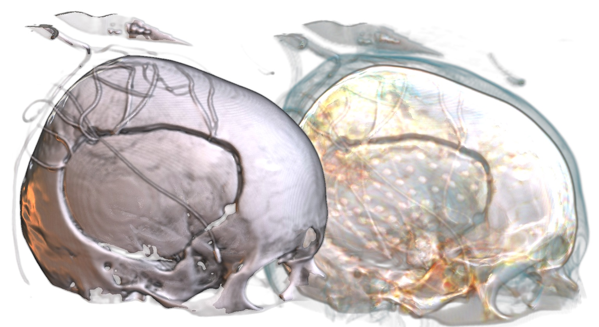
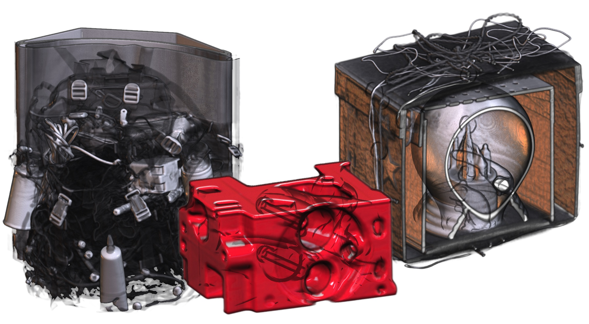
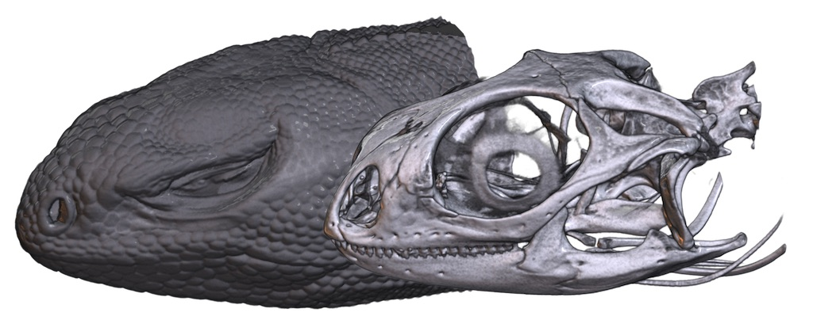

## About

This repository provides sample datasets for volume rendering. The voxelwise data is saved in the [NIfTI](https://nifti.nimh.nih.gov/nifti-1/data) format. All of these samples are open source. See specific folders for sources and individual licenses. This repository provides examples of the volumes that have beeen cropped and have had air removed, yielding much smaller file sizes (you can always go to the source repositories to get the full fat volumes).

 - [OpenSciVis](OpenSciVis/README.md) provides a collection of classic volume rendering scans sampled from the [Open Scientific Visualization Datasets](https://klacansky.com/open-scivis-datasets/).
 - [Prism](Prism/README.md) includes clinical images from the [PRISMDatabase](https://github.com/IbisNeuronav/PRISMDatabase) showing a brain tumor and an arteriovenous malformation (AVM).
 - [iguana](iguana/README.md) is a CT of a Dipsosaurus dorsalis from [DigiMorph](http://digimorph.org/specimens/Dipsosaurus_dorsalis/).
 - [seg3D](seg3D/README.md) provides a clinical MRI and CT scan from an individual with subdural grid electrodes from the [Seg3DData repository](https://github.com/CIBC-Internal/Seg3DData).
 - [stroke](stroke/README.md) provides brain-extracted MRI scans (T1, T2, FLAIR) of an individual with chronic stroke.

 
## Viewing the Datasets

There are many terrific free tools for viewing volume data. Since they are free, consider downloading a few and using the best tool for the task at hand.

 - [DragonFly](https://www.theobjects.com/dragonfly/get-non-commercial-licensing-program.html) is not open source, but non-commercial licenses are granted free-of-charge.
 - [Drishti](https://github.com/nci/drishti) has powerful rendering abilities, though support for medical imaging formats is limited. Robert Asher provides [YouTube videos describing the functions](https://www.youtube.com/channel/UCIpfqI07qSnCSBxe3JvdgSg/videos).
 - [InVesalius](https://invesalius.github.io) provides useful segmentation tools.
 - [MRIcroGL](https://www.nitrc.org/projects/mricrogl) was used to generate the renderings shown here.
 - [Seg3D](https://www.sci.utah.edu/cibc-software/seg3d.html) has powerful segmentation routines.
 - [Slicer](https://www.slicer.org) is a flexible tool. The [SlicerMorph](https://github.com/SlicerMorph/W_2020) workshops provide workshops for using this tool. [
Peter Falkingham provides a YouTube video](https://www.youtube.com/watch?v=dnwfKBj4WTs&feature=youtu.be) showing how to import a file and prepare it for 3D printing.

## Other Datasets

 - [Anatomical Tracings of Lesions After Stroke](https://github.com/npnl/ATLAS) provides T1 scans and lesion maps from  hundreds of individuals with stroke.
 - [CrocBase](https://osf.io/6zamj/) provides DICOM images of crocodiles.
 - [DigiMorph](http://digimorph.org/listallapplets.phtml?mt=6) provides living and extinct vertebrates and invertebrates.
 - [MorphoSource](https://www.morphosource.org) has around 13,000 open access biological specimens.
 - The [dcm2niix wiki](https://www.nitrc.org/plugins/mwiki/index.php/dcm2nii:MainPage#Sample_DICOM_Images) provides many DICOM samples as well as links to other resources.
 

